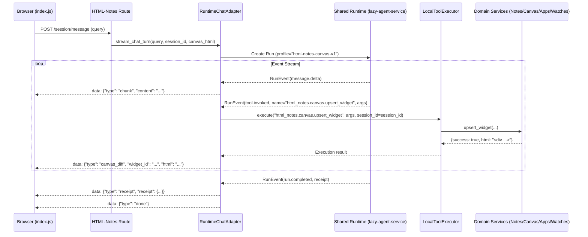

# HTML-Notes System Architecture & Boundary Model

**Version**: 2.1.0  
**Status**: Authoritative Reference  
**Last Updated**: 2026-09-19  

---

## 1. Executive Summary & Philosophy

HTML-Notes is an interactive canvas-based research and productivity workbench. Its core architecture follows a fundamental boundary principle:

> **Make capabilities global when their semantics are app-neutral; make resource access, policy, state, and presentation application-owned.**

| Layer | Authority / Repo | Responsibility | Examples |
|---|---|---|---|
| **Shared Execution Runtime** | `lazy-agent-service` | Run lifecycle, queueing, state machine, deadlines, retries, idempotency, event protocol, receipts | Run state machine, admission budget, RunEvent v1 stream |
| **Global Capability Providers** | `lazy-agent-service` | App-neutral generic operations | `global.web.search`, `global.web.read_page`, `global.data.transform` |
| **Transport & SDK** | `lazycat-sdk` | Typed client, protocol envelopes, event framing | `RuntimeClient`, `CreateRunRequest`, `RunEvent` |
| **Application Profile & Manifests** | `HTML-Notes` (`app/tooling/manifests/`) | Allowed capabilities, budgets, models, tool schemas | `html_notes.profile.json`, `html_notes.domain-tools.json`, `html_notes.widget-catalog.json` |
| **Application Domain Tools** | `HTML-Notes` (`app/domain/`) | App resource access, state mutations, authorization, audit | Notes CRUD, Canvas DOM mutations, Portal app discovery, Watches |
| **Presentation & UX** | `HTML-Notes` (`app/presentation/`, `app/widgets/`) | Server-side widget rendering, canvas DOM reconciliation, client SSE | Widget factory, 26+ pre-built widgets, SSE wire protocol |

---

## 2. Layered Bounded Architecture & Resource Ownership

The codebase is organized into strict, decoupled layers where domain services are the exclusive resource owners:

| Domain Service | Exclusive Ownership | Forbidden Content / Side Effects |
|---|---|---|
| `notes` | Note CRUD, tags, backlinks, sanitization, revisions | Runtime protocol or SSE wire formatting |
| `canvas` | Widget state, singleton rules, server rendering, canvas persistence | Generic web search or runtime admission logic |
| `apps` | Portal discovery, app lookup, approved app action dispatch | Canvas rendering implementation |
| `watches` | Watch lifecycle, scheduling metadata, session scope | Generic agent loop or runner logic |
| `providers` | Presentation adapters for weather/sports/stocks/news/youtube | Shared runtime lifecycle or state machine |
| `presentation` | SSE/component formatting and widget catalog display mapping | Database mutations or business policy |

```text
app/
├── domain/                  # 100% Application-owned business logic & resource mutators
│   ├── notes/               # Notes CRUD, search, link graph, HTML auditor
│   ├── canvas/              # Canvas DOM mutations, inspection, singleton policies
│   │   └── legacy_custom_widgets.py # Quarantined deprecated custom widget sandbox
│   ├── apps/                # Portal registry discovery, curation, and action execution
│   └── watches/             # Background watches and reactive notifications
├── tooling/                 # Manifest indexing, admission policy & execution engine
│   ├── manifests/           # Authoritative JSON manifests (tools, profile, widgets)
│   ├── html_notes_manifest.py # Manifest registry and spec resolver
│   ├── policy.py            # Admission policy, effect classification, confirmation gates
│   └── local_executor.py    # Modular local tool execution dispatcher
├── adapters/                # Protocol and provider integration bridges
│   ├── runtime/             # RuntimeChatAdapter (converts RunEvents to client SSE)
│   └── providers/           # Presentation provider feeds (weather, sports, stocks, news, youtube)
└── presentation/            # User-facing rendering and wire framing
    ├── sse/                 # Standardized SSE frame serializer
    └── widgets/             # Declarative widget catalog and metadata
```

---

## 3. Tool Taxonomy & Effect Model

All operations adhere to a namespaced taxonomy and explicit effect classification:

### 3.1 Taxonomy
- `global.web.search`: Global web retrieval (owned by shared runtime).
- `global.web.read_page`: Global page extraction (owned by shared runtime).
- `global.data.transform`: Pure data manipulation (JSON-in / JSON-out, no side effects).
- `html_notes.notes.*`: Notes domain operations (`create`, `update`, `get`, `search`, `link`).
- `html_notes.canvas.*`: Canvas operations (`read`, `upsert_widget`, `remove_widget`, `mutate`).
- `html_notes.apps.*`: Apps and portal ecosystem operations (`list`, `open`, `list_actions`, `execute_action`, `curate`).
- `html_notes.watches.*`: Background watch operations (`create`, `list`, `cancel`).
- `html_notes.widgets.*`: Widget catalog discovery (`list_catalog`).
- `html_notes.<provider>.*`: App-local presentation feeds (`weather.get`, `sports.scores`, `finance.stock_history`, `news.get_news`, `media.youtube_search`).

### 3.2 Effect Classifications & Safety Rules
1. **`read`**: Read-only query. Concurrency safe, requires `["app_id"]` scope.
2. **`write`**: Local state mutation (e.g. creating notes, upserting canvas widgets). Audited and strictly scoped to `["app_id", "session_id"]`.
3. **`destructive`**: High-risk mutations (e.g. terminating portal services, executing destructive portal commands). **Requires explicit user confirmation** before execution.

### 3.3 DOM Mutation Restriction Policy
- **Server-rendered widgets**: `html_notes.canvas.upsert_widget` / `html_notes.canvas.remove_widget` only.
- **User notes**: `html_notes.notes.create` / `html_notes.notes.update` only.
- **Custom experimental widgets**: Quarantined in `app/domain/canvas/legacy_custom_widgets.py`, omitted from default profile.
- **Generic arbitrary DOM mutation**: Disabled by default in policy; constrained strictly to exact `#id` selectors with sanitized HTML markup.

---

## 4. Widget Lifecycle & API Rationalization

### 4.1 Canonical Path: Server-Rendered Catalog Widgets
- Canonical Tool: `html_notes.canvas.upsert_widget` (legacy alias: `canvas_add_widget`).
- Mechanism: Config is passed to the server-side factory (`app/widgets/factory.py`), which deterministically renders self-contained markup (`generate_widget_html`).
- Re-use vs Spawn: Passing an existing `widget_id` updates that widget in place without adding duplicates. Singletons (such as `map`, `weather`, `app_grid`, `settings`, `quality_profile`, `mini_music_player`) re-use their identity.

### 4.2 Deprecated & Quarantined: Custom Widget Sandbox
- Overlapping legacy tools (`create_widget`, `plan_widget`, `update_widget`, `list_widget_types`, `validate_widget_html`) are **deprecated** and quarantined in `app/domain/canvas/legacy_custom_widgets.py`.
- They are omitted from the default agent profile whitelist (`html_notes.profile.json`) to eliminate prompt confusion.

---

## 5. End-to-End Execution Flow


