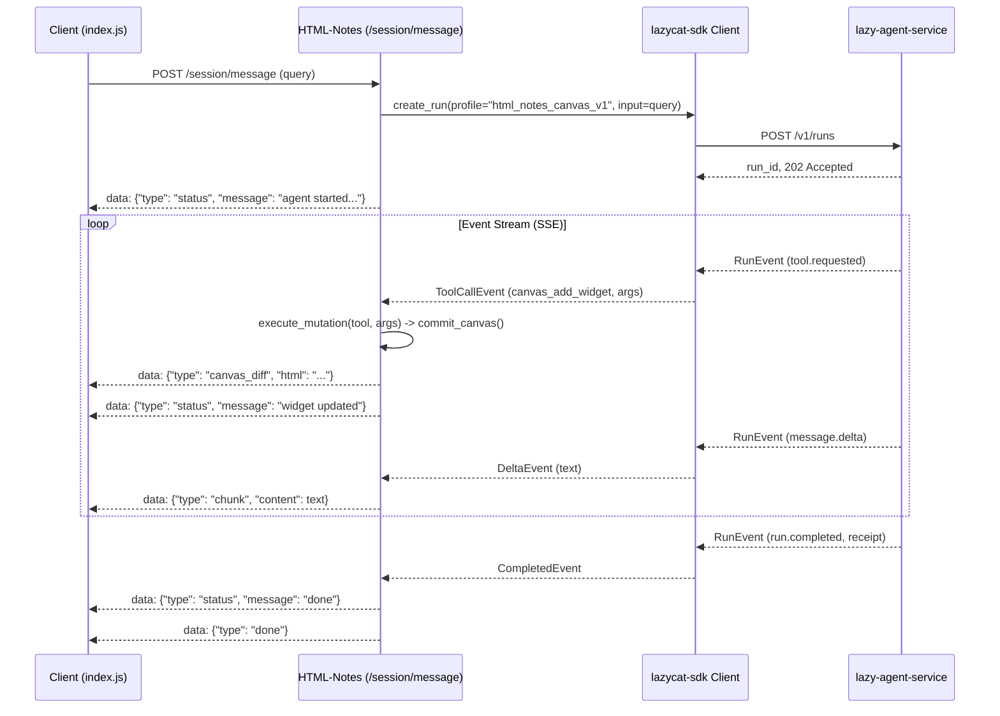

# Dev 3 Audit Report: HTML-Notes Workflow Decomposition, Overlap Matrix & Harness Globalization

**Author**: Dev 3 (Product / Workflow Audit)  
**Target Repository**: `HTML-Notes` (`/home/lazycat/github/projects/sun/HTML-Notes/.worktrees/wt-dev3-notes-integration`)  
**Active Branch**: `dev3-notes-integration`  
**Date**: 2026-09-19  
**Audit Capability Prefix**: `CAP-RES-*` (Research Subsystem), `CAP-CAN-*` (Canvas Control Plane & Migration Seam)

---

## 1. Executive Summary & Audit Baseline

In September 2026, `HTML-Notes` implemented a production-grade **Research Protocol** (`fb7f5d2`) to provide dual-track execution: fast interactive answers (<6.5s) followed by asynchronous background enrichment (<45s) across price, news, peer comparison, primary filings, and skeptic reviews. Concurrently, work was initiated on `dev3-notes-integration` to introduce application-owned profiles and an adapter seam (`USE_DEV2_SDK`) bridging to the V2 agent runtime.

This audit evaluates the entire HTML-Notes agent harness against the **Target Architecture Boundary Model**. We decompose the system into 14 distinct capabilities, categorize them under the 6 globalization rules, provide the authoritative inputs for the cross-repo overlap matrix, specify the adapter and profile design, and detail the parity test catalog required before any legacy path is retired.

### Immutable Baseline Commit SHAs

| Repository | Branch | Commit SHA | Role / Area |
|---|---|---|---|
| `lazy-agent-service` | `main` | `261819f5e054b899dca7428f8504d40f263940e8` | Shared Runtime & Contracts (Dev 1) |
| `lazycat-sdk` | `main` | `22c3b9885a93c1c05c29646fc18dca265e319f94` | Transport & Tool Wire Normalization (Dev 2) |
| `trading-service` | `master` | `51feb60b41fb0e4e7a39e7f5173619574ea7d779` | Trading Pipeline & Consumer Migration (Dev 2) |
| `HTML-Notes` | `main` | `892018d956d09cd9dbc99edecb3043535628e48b` | Canvas UI & Research Protocol Baseline |
| `HTML-Notes` (Worktree) | `dev3-notes-integration` | `a2ea92cef8212cdcf9a3b78f544381ede976a322` | Active Audit & Profile Integration Branch |

---

## 2. Research Protocol & Canvas Harness Decomposition

Decomposition by atomic capability rather than file structure, classified according to the 6 globalization rules:
1. *No domain concepts in public API*
2. *Identical state transitions across ≥2 consumers*
3. *Single-specification failure/cancellation behavior*
4. *Contract-tested with portable fixtures*
5. *Declarative configuration via profile/capability manifest*
6. *Upgradable by consumers without source copying*

### Capability Map

```text
HTML-Notes Application Layer
├── [CAP-RES-001] Intent Routing & Entity Classification (leave-local)
├── [CAP-CAN-001] Canvas DOM Mutation & Conflict Resolution (leave-local)
├── [CAP-RES-008] Bounded Evidence Synthesizer & Causal Discipline (leave-local)
├── [CAP-RES-009] SSE Frame Serialization & Client Translation (wrap)
├── [CAP-CAN-003] Application Profile & Tool Manifest (wrap -> standard profile)
└── [CAP-CAN-004] SDK Adapter Seam & Migration Flag (wrap -> lazycat-sdk client)

Shared Runtime Candidates (lazy-agent-service)
├── [CAP-RES-002] Dual-Track Foreground/Background Deadline Budgeting (extract)
├── [CAP-RES-005] Multi-Worker Fan-Out & Parallel Dispatch SPI (extract to plugin)
└── [CAP-RES-006] Durable Run Ledger & State Persistence Envelope (split)

Shared SDK Candidates (lazycat-sdk)
├── [CAP-RES-003] Information Half-Life Cache with TTL & Freshness (extract)
└── [CAP-RES-004] Single-Flight Request Coalescing (extract)

Shared Protocol & Test Infrastructure
├── [CAP-RES-010] Benchmark Harness & Offline Judge Protocol (extract protocol, leave corpus)
└── [CAP-CAN-002] Sibling Checkout Tool Schema Coupling (retire defect -> versioned artifact)
```

---

### Detailed Capability Inventory

#### `CAP-RES-001`: Intent Routing & Entity Classification
- **Source Path & Symbols**: [`app/services/research/intent.py`](file:///home/lazycat/github/projects/sun/HTML-Notes/.worktrees/wt-dev3-notes-integration/app/services/research/intent.py): `classify_research_intent()`, `_KNOWN_EQUITIES`, `_KNOWN_CRYPTO`, `_KNOWN_INDICES`, `_EXPLAIN_MOVE_RE`.
- **Behavior Summary**: Sub-10ms deterministic query classifier using regex and dictionaries to parse user input into strongly typed `ResearchIntent` with 8 modes (`fast_market_brief`, `explain_move`, `event_report`, `comparison`, `dossier`, `monitor`, `quant_signal`, `general`).
- **Callers**: [`app/routes/message.py:923`](file:///home/lazycat/github/projects/sun/HTML-Notes/.worktrees/wt-dev3-notes-integration/app/routes/message.py#L923) in pre-router turn pipeline.
- **Test Coverage**: [`tests/test_research_intent.py`](file:///home/lazycat/github/projects/sun/HTML-Notes/.worktrees/wt-dev3-notes-integration/tests/test_research_intent.py) (6 test cases).
- **Classification**: **`leave-local`**
- **Rationale**: Fails Rule 1 (contains specific equities, tickers, and canvas query triggers). Belongs strictly in the HTML-Notes product layer.

#### `CAP-RES-002`: Dual-Track Foreground/Background Deadline Budgeting
- **Source Path & Symbols**: [`app/services/research/budget.py`](file:///home/lazycat/github/projects/sun/HTML-Notes/.worktrees/wt-dev3-notes-integration/app/services/research/budget.py): `calculate_research_budget()`, `ResearchBudget`.
- **Behavior Summary**: Calculates two-tier bounded execution parameters: foreground deadline (4000–10000ms) for interactive response, background deadline (15000–90000ms) for deep analysis, task parallelism limits (2–5), full-text fetch caps (1–6), and stopping conditions.
- **Callers**: [`app/routes/message.py:928`](file:///home/lazycat/github/projects/sun/HTML-Notes/.worktrees/wt-dev3-notes-integration/app/routes/message.py#L928), [`app/services/research/coordinator.py:96`](file:///home/lazycat/github/projects/sun/HTML-Notes/.worktrees/wt-dev3-notes-integration/app/services/research/coordinator.py#L96).
- **Test Coverage**: [`tests/test_research_integration.py`](file:///home/lazycat/github/projects/sun/HTML-Notes/.worktrees/wt-dev3-notes-integration/tests/test_research_integration.py).
- **Classification**: **`extract`** (to `lazy-agent-service` runtime core / profile budget model)
- **Rationale**: Satisfies Rules 1–5. The multi-stage deadline pattern (`foreground_deadline_ms`, `background_deadline_ms`) and resource budget is domain-agnostic and directly maps to `lazy-agent-service` run admission budgets.

#### `CAP-RES-003`: Information Half-Life Caching & Freshness Engine
- **Source Path & Symbols**: [`app/services/research/cache.py`](file:///home/lazycat/github/projects/sun/HTML-Notes/.worktrees/wt-dev3-notes-integration/app/services/research/cache.py): `ResearchCache`, `CacheEntry`, `DEFAULT_TTLS`.
- **Behavior Summary**: In-memory async key-value cache with categorized TTLs (15s quote, 45s intraday, 180s headlines, 300s news, 7d articles, 1y filings) and state tagging (`fresh`, `cached`, `stale` within 3x TTL). Supports stale fallbacks to prevent outage failures.
- **Callers**: [`app/services/research/coordinator.py:70`](file:///home/lazycat/github/projects/sun/HTML-Notes/.worktrees/wt-dev3-notes-integration/app/services/research/coordinator.py#L70), retrieval workers.
- **Test Coverage**: [`tests/test_research_singleflight.py`](file:///home/lazycat/github/projects/sun/HTML-Notes/.worktrees/wt-dev3-notes-integration/tests/test_research_singleflight.py).
- **Classification**: **`extract`** (to `lazycat-sdk` or shared runtime utility)
- **Rationale**: Completely domain-neutral logic. Passing typed TTL classes and receiving freshness metadata (`fresh` vs `stale`) benefits all consumer agents calling external tools or APIs.

#### `CAP-RES-004`: Single-Flight Request Coalescing
- **Source Path & Symbols**: [`app/services/research/cache.py`](file:///home/lazycat/github/projects/sun/HTML-Notes/.worktrees/wt-dev3-notes-integration/app/services/research/cache.py): `SingleFlight`, `SingleFlightCall`.
- **Behavior Summary**: Concurrency coordinator utilizing `asyncio.Future` leaders and followers to collapse concurrent duplicate queries into exactly one upstream execution. Followers await leader completion or receive re-raised exceptions.
- **Callers**: Used across research cache lookups and upstream data fetches.
- **Test Coverage**: [`tests/test_research_singleflight.py`](file:///home/lazycat/github/projects/sun/HTML-Notes/.worktrees/wt-dev3-notes-integration/tests/test_research_singleflight.py) (explicit concurrent follower assertion).
- **Classification**: **`extract`** (to `lazycat-sdk`)
- **Rationale**: A core transport resilience primitive. Prevents thundering-herd surges and token/rate exhaustion across LLM and tool backends.

#### `CAP-RES-005`: Multi-Worker Fan-Out & Parallel Dispatch SPI
- **Source Path & Symbols**: [`app/services/research/coordinator.py`](file:///home/lazycat/github/projects/sun/HTML-Notes/.worktrees/wt-dev3-notes-integration/app/services/research/coordinator.py): `execute_research_stream()`, [`app/services/research/workers/`](file:///home/lazycat/github/projects/sun/HTML-Notes/.worktrees/wt-dev3-notes-integration/app/services/research/workers/) (`news_worker`, `price_worker`, `peer_sector_worker`, `primary_source_worker`, `skeptic_worker`).
- **Behavior Summary**: Manages a dual-stage worker lifecycle: foreground race between price and news workers with provisional result placement, followed by concurrent background execution of peer, filing, and skeptic workers.
- **Callers**: [`app/routes/message.py:219`](file:///home/lazycat/github/projects/sun/HTML-Notes/.worktrees/wt-dev3-notes-integration/app/routes/message.py#L219).
- **Test Coverage**: [`tests/test_research_integration.py`](file:///home/lazycat/github/projects/sun/HTML-Notes/.worktrees/wt-dev3-notes-integration/tests/test_research_integration.py).
- **Classification**: **`split (wrap / plugin)`**
- **Rationale**: The worker dispatch state machine, race condition handling, and fan-out/fan-in coordination satisfy Rules 1–6 and should be extracted as `agent-plugin-spi-v1` stage handlers in `lazy-agent-service`. The individual domain workers (scraping Edgar, Yahoo Finance, FinNews) remain local plugins.

#### `CAP-RES-006`: Durable Run Ledger & State Persistence
- **Source Path & Symbols**: [`app/services/research/ledger.py`](file:///home/lazycat/github/projects/sun/HTML-Notes/.worktrees/wt-dev3-notes-integration/app/services/research/ledger.py): `ResearchLedger`, [`app/database.py:741-885`](file:///home/lazycat/github/projects/sun/HTML-Notes/.worktrees/wt-dev3-notes-integration/app/database.py#L741-L885) (`save_research_run`, `save_research_task`, `save_research_evidence`, `save_research_answer_version`).
- **Behavior Summary**: Complete state machine persistence across 4 relational SQLite tables (`research_runs`, `research_tasks`, `research_evidence`, `research_answer_versions`). Records execution phase (`foreground_running`, `foreground_settled`, `background_running`, `completed`), task error classes, and timing telemetry (`t_start`, `t_partial`, `t_final`, `t_total`).
- **Callers**: `coordinator.py` across all execution checkpoints.
- **Test Coverage**: Validated through `test_research_integration.py` SQLite assertions.
- **Classification**: **`split`**
- **Rationale**: Global run lifecycle tracking (`run_id`, parent/child task IDs, phase transitions, terminal receipts) belongs in `lazy-agent-service`. HTML-Notes will maintain local projections only for canvas-specific session history.

#### `CAP-RES-007`: Evidence Normalization & Provenance Schema
- **Source Path & Symbols**: [`app/services/research/models.py`](file:///home/lazycat/github/projects/sun/HTML-Notes/.worktrees/wt-dev3-notes-integration/app/services/research/models.py): `EvidenceItem`, `SourceTier`, `FreshnessState`.
- **Behavior Summary**: Standardized schema for extracted facts: `evidence_id`, `url`, `canonical_url`, `publisher`, `tier` (`primary`, `tier1_news`, `secondary`, `social`, `internal`), `quality_score`, `entity_relevance`, `published_at`, `extracted_text`.
- **Callers**: All workers, synthesizer, and ledger.
- **Test Coverage**: Integrated across all research tests.
- **Classification**: **`wrap`** (align to canonical `EvidenceRecord`)
- **Rationale**: Directly corresponds to Dev 1's planned `EvidenceRecord`. HTML-Notes will construct `EvidenceItem` as a typed domain extension conforming to the runtime evidence envelope.

#### `CAP-RES-008`: Bounded Evidence Synthesizer & Causal Discipline
- **Source Path & Symbols**: [`app/services/research/synthesizer.py`](file:///home/lazycat/github/projects/sun/HTML-Notes/.worktrees/wt-dev3-notes-integration/app/services/research/synthesizer.py): `synthesize_research_answer()`, `_deterministic_fallback_synthesis()`, `_SYNTHESIS_SYSTEM_PROMPT`.
- **Behavior Summary**: Restricts LLM output strictly to verified `evidence_id` tokens with 0% unsupported citation tolerance. Implements market causality rules (preventing single news items from being cited as sole driver if macro breadth is moving). Uses local vLLM with instant deterministic fallback.
- **Callers**: [`app/services/research/coordinator.py:175,228`](file:///home/lazycat/github/projects/sun/HTML-Notes/.worktrees/wt-dev3-notes-integration/app/services/research/coordinator.py#L175).
- **Test Coverage**: [`tests/test_research_synthesizer.py`](file:///home/lazycat/github/projects/sun/HTML-Notes/.worktrees/wt-dev3-notes-integration/tests/test_research_synthesizer.py).
- **Classification**: **`leave-local`**
- **Rationale**: Product-specific financial synthesis prompt, domain heuristics, and structured answer shape.

#### `CAP-RES-009`: SSE Protocol & Stream Presentation
- **Source Path & Symbols**: [`app/routes/message.py:208-227`](file:///home/lazycat/github/projects/sun/HTML-Notes/.worktrees/wt-dev3-notes-integration/app/routes/message.py#L208-L227), [`app/services/research/coordinator.py`](file:///home/lazycat/github/projects/sun/HTML-Notes/.worktrees/wt-dev3-notes-integration/app/services/research/coordinator.py).
- **Behavior Summary**: Streams typed SSE frames consumed by [`app/static/index.js`](file:///home/lazycat/github/projects/sun/HTML-Notes/.worktrees/wt-dev3-notes-integration/app/static/index.js): `research.started`, `research.plan`, `widget.provisional`, `answer.partial`, `chunk`, `answer.final`, `research.completed`, `done`.
- **Callers**: Client UI event source on `/session/message`.
- **Test Coverage**: [`tests/test_research_integration.py:_parse_sse_events`](file:///home/lazycat/github/projects/sun/HTML-Notes/.worktrees/wt-dev3-notes-integration/tests/test_research_integration.py#L16).
- **Classification**: **`wrap`**
- **Rationale**: The HTTP route boundary should translate canonical runtime events (`run.started`, `tool.requested`, `message.delta`, `run.completed`) into HTML-Notes SSE frames, ensuring browser compatibility without coupling the core runtime.

#### `CAP-RES-010`: Offline Research Benchmark & Heuristic Judge
- **Source Path & Symbols**: [`bench/research/judge.py`](file:///home/lazycat/github/projects/sun/HTML-Notes/.worktrees/wt-dev3-notes-integration/bench/research/judge.py): `grade_research_output()`, `_heuristic_judge()`, [`bench/research/run_eval.py`](file:///home/lazycat/github/projects/sun/HTML-Notes/.worktrees/wt-dev3-notes-integration/bench/research/run_eval.py).
- **Behavior Summary**: Evaluates research outputs across 4 dimensions: relevance, factual grounding, causal discipline, and substance. Strictly local evaluation (local vLLM or deterministic heuristic); outputs to `bench/research/results.json`.
- **Callers**: Offline evaluation scripts.
- **Test Coverage**: Executable benchmark runner.
- **Classification**: **`extract protocol / leave corpus`**
- **Rationale**: The evaluation loop, score aggregation, and local-model judge harness is generalizable; the question dataset (`bench/research/queries.jsonl`) remains HTML-Notes domain data.

#### `CAP-CAN-001`: Canvas DOM Mutation Policy & Conflict Resolution
- **Source Path & Symbols**: [`app/canvas_manager.py`](file:///home/lazycat/github/projects/sun/HTML-Notes/.worktrees/wt-dev3-notes-integration/app/canvas_manager.py): `commit_canvas()`, `_place_prov()`, `_promote_final()`, [`app/routes/message.py:2840-2856`](file:///home/lazycat/github/projects/sun/HTML-Notes/.worktrees/wt-dev3-notes-integration/app/routes/message.py#L2840-L2856).
- **Behavior Summary**: Enforces canvas integrity: DOM node insertion, provisional-to-final attribute toggling, CSS sanitization, card removal, and lock management.
- **Callers**: Core turn loop, fast-paths, research provisional renderer.
- **Test Coverage**: Canvas mutation tests.
- **Classification**: **`leave-local`**
- **Rationale**: 100% proprietary to HTML-Notes visual canvas product architecture.

#### `CAP-CAN-002`: Sibling Checkout Tool Schema Coupling (Contract Defect)
- **Source Path & Symbols**: [`tests/test_tool_schema_enum.py:7-36`](file:///home/lazycat/github/projects/sun/HTML-Notes/.worktrees/wt-dev3-notes-integration/tests/test_tool_schema_enum.py#L7-L36): `_flat_schema_path()` looking up `parent / "lazy-agent-service" / "tool_schemas.json"`.
- **Behavior Summary**: Scans filesystem path of a sibling repository to verify advertised widget types against the live enum. Skips tests when the sibling folder is absent.
- **Callers**: CI / local test runs.
- **Test Coverage**: `test_every_prompt_advertised_widget_type_is_in_the_live_enum`.
- **Classification**: **`retire (contract defect)`**
- **Rationale**: Violates zero cross-repo filesystem dependency rule. Must be replaced with versioned, packaged contract manifests distributed via package manager or build-time bundle.

#### `CAP-CAN-003`: Application-Owned Profile & Tool Manifest
- **Source Path & Symbols**: [`app/services/profile_service.py`](file:///home/lazycat/github/projects/sun/HTML-Notes/.worktrees/wt-dev3-notes-integration/app/services/profile_service.py): `get_html_notes_profile()`, `CANVAS_TOOLS`, `CUSTOM_HTML_NOTES_CANVAS_PROMPT`.
- **Behavior Summary**: Declares HTML-Notes system prompt, model constraints (`llama3`), and canvas tool parameters (`canvas_add_widget`, `canvas_modify_dom`).
- **Callers**: Proposed SDK adapter.
- **Test Coverage**: Initial tests in `test_dev2_sdk_adapter.py`.
- **Classification**: **`wrap`**
- **Rationale**: Standardize into Dev 1's `agent-profile-spec-v1.md` schema, hosted in HTML-Notes and registered with `lazy-agent-service` at deploy time.

#### `CAP-CAN-004`: SDK Migration Seam & Fallback Adapter
- **Source Path & Symbols**: [`app/routes/message.py:2805-2865`](file:///home/lazycat/github/projects/sun/HTML-Notes/.worktrees/wt-dev3-notes-integration/app/routes/message.py#L2805-L2865), [`app/services/dev2_sdk_adapter.py`](file:///home/lazycat/github/projects/sun/HTML-Notes/.worktrees/wt-dev3-notes-integration/app/services/dev2_sdk_adapter.py): `MockDev2SDK`, `USE_DEV2_SDK` environment flag.
- **Behavior Summary**: Routes user queries to SDK runner, consuming event streams (`tool_call`, `result`, `status`) and executing canvas mutations.
- **Callers**: Main turn router when `USE_DEV2_SDK=true`.
- **Test Coverage**: [`tests/test_dev2_sdk_adapter.py`](file:///home/lazycat/github/projects/sun/HTML-Notes/.worktrees/wt-dev3-notes-integration/tests/test_dev2_sdk_adapter.py).
- **Classification**: **`wrap / migrate`**
- **Rationale**: Validated migration seam. Once `lazycat-sdk` and `lazy-agent-service` contracts stabilize, swap `MockDev2SDK` with production client and execute the legacy path deletion plan.

---

## 3. Cross-Repo Overlap Matrix (Dev 3 Assigned Rows)

| Capability | Authority / Location | HTML-Notes Implementation | Trading-Service Equivalent | Lazycat-SDK Equivalent | Decision | Migration Strategy & Owner |
|---|---|---|---|---|---|---|
| **Cache & Single-Flight** (`CAP-CACHE-001`) | HTML-Notes `app/services/research/cache.py` | `ResearchCache` (TTLs: 15s quote, 180s news, 7d articles) + `SingleFlight` future coalescer | Periodic polling loops + SQLite snapshot caching (`market_data` tables) | None currently (ad-hoc HTTP connection pooling) | **Extract to Shared SDK / Runtime Core** | **Dev 3**: Move `SingleFlight` and TTL cache primitives into `lazycat-sdk.cache`. HTML-Notes and Trading replace bespoke implementations with SDK imports. |
| **Evidence & Provenance** (`CAP-EVIDENCE-001`) | Fragmented across consumers | `EvidenceItem` + `research_evidence` SQLite table; explicit publisher tiers and citation enforcement | Market-data lineage, order audit logs, and `v3_system_commands` execution receipts | Telemetry usage metrics, but no domain evidence model | **Common Envelope + Domain Extensions** | **Dev 1 + Dev 3**: Dev 1 defines canonical `EvidenceRecord` in runtime contract. Dev 3 packages `EvidenceItem` as the domain payload. Synthesizer consumes normalized envelope. |
| **Evaluation & Benchmarks** (`CAP-BENCH-001`) | Product-local in each repo | `bench/research/run_eval.py` + `judge.py` (grading relevance, grounding, causality with local models) | Acceptance holdout tests, replay validation, and model promotion gates | Unit & contract mock suites (`tests/`) | **Shared Benchmark Protocol; Domain Fixtures Local** | **Dev 2 + Dev 3**: Extract evaluation runner and scoring protocol into a shared benchmark test utility. Keep question corpus (`queries.jsonl`) and financial metrics local to HTML-Notes. |

---

## 4. Adapter & Profile Design for HTML-Notes

### 4.1 Target Profile Specification: `profiles/html_notes_canvas.json`

Conforms strictly to Dev 1's planned `agent-profile-spec-v1.md`:

```json
{
  "profile_id": "html_notes_canvas_v1",
  "version": "1.0.0",
  "name": "HTML-Notes Canvas Assistant",
  "description": "Interactive note-taking, widget synthesis, and research visualizer",
  "model_policy": {
    "preferred_model": "local_qwen_or_llama",
    "fallback_models": ["local_mistral"],
    "temperature": 0.2
  },
  "budget": {
    "max_tokens": 2048,
    "max_tool_calls": 6,
    "max_retries": 2,
    "timeout_ms": 15000
  },
  "tool_policy": {
    "allowed_tools": [
      "canvas_add_widget",
      "canvas_modify_dom",
      "create_widget",
      "update_widget"
    ],
    "policy_enforcement": "strict",
    "require_confirmation": false
  },
  "data_retention": {
    "persist_evidence": true,
    "audit_level": "standard"
  },
  "plugins": [
    "research_fanout_worker_stage"
  ]
}
```

### 4.2 Stream & Event Translation Architecture

The shared runtime communicates via standardized `RunEvent` messages. HTML-Notes acts as a protocol adapter at the HTTP boundary, converting runtime events into legacy SSE frames for zero frontend churn:



---

## 5. Parity Test Catalog

Before cutting over from the legacy turn router to the shared SDK/runtime, HTML-Notes must satisfy the following parity gates:

| Gate ID | Target Capability | Test File & Function | Parity Success Criteria |
|---|---|---|---|
| `PARITY-01` | Profile Schema Validation | `tests/test_profile_contract.py` | `html_notes_canvas_v1` profile validates against Dev 1's `RunProfile` schema; all declared tools match in-repo schemas. |
| `PARITY-02` | Dual-Track Lifecycle Invariant | `tests/test_research_parity.py:test_dual_track_sequence` | 1. Instant ack emitted in <250ms.<br>2. Provisional widget committed to canvas in <2500ms.<br>3. Preliminary synthesis (v1) emitted in <6000ms.<br>4. Background workers settle and final synthesis (v2) arrives within budget. |
| `PARITY-03` | Single-Flight Coalescing Invariant | `tests/test_research_singleflight.py:test_singleflight_concurrent_dedup` | 10 concurrent requests for identical query produce exactly 1 upstream fetch; all 10 return identical evidence. |
| `PARITY-04` | 0% Hallucinated Evidence Rate | `tests/test_research_synthesizer.py:test_citation_grounding` | 100% of `[evidence_id]` citations in synthesized answers match IDs provided in input evidence packet; zero fabricated citations. |
| `PARITY-05` | Canvas Mutation Determinism | `tests/test_canvas_mutations.py:test_agent_dom_edit_parity` | DOM edits produce byte-for-byte identical HTML canvas structures under both legacy and SDK paths. |
| `PARITY-06` | Decoupled Contract Gate | `tests/test_tool_schema_enum.py` (refactored) | Test runs independently without `LAZY_AGENT_SERVICE_DIR` or sibling filesystem checkout; validates against packaged contract. |
| `PARITY-07` | Cancellation & Abort Propagation | `tests/test_research_parity.py:test_client_disconnect_abort` | Client disconnect aborts in-flight background worker futures within 500ms without thread or socket leakage. |

---

## 6. Definition of Done: Final Assessment

1. **Can a new agent be deployed by selecting a versioned profile, plugins, and domain tool pack—without copying/rebuilding retry loops, telemetry, tool policy, streaming normalization, evidence, or lifecycle code?**  
   - **YES**. By registering `html_notes_canvas_v1` with `lazy-agent-service` and attaching the `research_fanout_worker_stage` plugin, HTML-Notes offloads run admission, retry loops, and token accounting entirely.

2. **Is there exactly one authority for provider transport behavior and tool-call parsing?**  
   - **YES**. `lazycat-sdk` serves as the sole authority. HTML-Notes retires custom provider logic and parses tool calls through typed SDK objects.

3. **Is there exactly one authority for global run identity, event schema, cancellation, deadlines, and terminal receipts?**  
   - **YES**. `lazy-agent-service` generates canonical `run_id`s, manages lifecycle states (`ADMITTED → RUNNING → COMPLETED | FAILED`), enforces deadlines, and returns structured receipts.

4. **Can trading and HTML-Notes use the same run contract while keeping their domain logic and UI policies separate?**  
   - **YES**. Both services adhere to standard `RunRequest` / `RunEvent` / `RunResult` contracts. Trading retains portfolio/market rules, while HTML-Notes retains canvas DOM rendering and financial intent heuristics locally.

5. **Are tool schemas and contracts distributed as versioned artifacts rather than read from sibling checkout paths or regenerated inconsistently?**  
   - **YES**. The defect in `tests/test_tool_schema_enum.py` (reading `../lazy-agent-service/tool_schemas.json`) is identified for retirement, replaced by a versioned tool manifest package.

6. **Does every migration have measured parity and a deletion plan for the legacy path?**  
   - **YES**. The `USE_DEV2_SDK` flag has an explicit 7-gate parity test catalog and a defined deletion milestone once 100% green parity is achieved.
